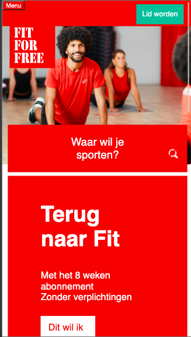
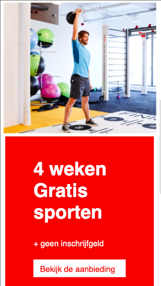
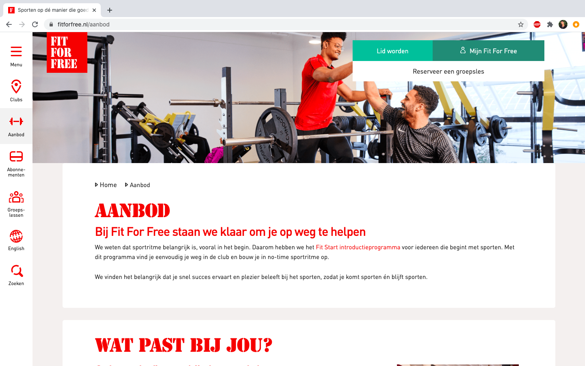

# Procesverslag
**Auteur:** Lalla Bah

Markdown cheat cheet: [Hulp bij het schrijven van Markdown](https://github.com/adam-p/markdown-here/wiki/Markdown-Cheatsheet). Nb. de standaardstructuur en de spartaanse opmaak zijn helemaal prima. Het gaat om de inhoud van je procesverslag. Besteedt de tijd voor pracht en praal aan je website.

## Bronnenlijst
1. -bron 1-
2. -bron 2-
3. -...-

## Eindgesprek (week 7/8)

-dit ging goed & dit was lastig-

**Screenshot(s):**

-screenshot(s) van je eindresultaat-

## Voortgang 3 (week 6)

https://codepen.io/shooft/pen/jOMOroZ NAV wil ik nog bekijken
Ik heb ervoor gezorgd dat er maar 1 H1 is per pagina. En om de br eruit te halen heb ik de width bij h1 op 300px gezet. Hierdoor komt het automatisch onder elkaar te staan.

Ik heb de padding en margin met left en right 2vw aangepast naar em de witte knop met de afbeelding verandererd waardoor pijltje er altijd naast komt te staan, ongeacht de breedte.

## Voortgang 2 (week 5)

Het is me eindelijk gelukt om de verschillende lettertypes toe te voegen, zorgen dat alles goed onder elkaar komt zonder 90em te gebruiken en het responsive te maken voor verschillende mobiele devices.

Ik ben best tevrede over de voortgang. Nog lang niet waar ik wil zijn, maar er zit zeker progressie in en dat is wel motiverend. Ik hoop dat ik bij het volgende voortgangsgesprek de buttons wat meer kan aan passen en dat ik het meer op mijn eigen manier kan doen. Ook hoop ik dat ik dan javascript kan toepassen voor kleine animaties van de knoppen.

[images/voortgang2.p.png] [images/voortgang2.fitstart.png] [images/voortgang2.opacity.png] [images/voortgang2.opties.png]

## Voortgang 1 (week 3)

### Stand van zaken

Het is me eigenlijk nog niet zo goed gelukt om de juiste font toe te voegen terwijl dit andere keren wel is gelukt. Daarnaast is hij nu alleen nog werkend voor 1 type telefoon. Ik wil hem responsive hebben voor welke telefoon dan ook. Dit is niet helemaal goed gegaan. Ik hoop dat ik dit komende weken kan verbeteren door meer te oefenen. 

Hij is nu "passend" voor een iphone 6/7/8 plus.

**Screenshot(s):**

### Agenda voor meeting

Meeting: 27 november 11:30

### Verslag van meeting

-na afloop snel uitkomsten vastleggen-

## Intake (week 1)

**Je startniveau:** blauwe piste

**Je focus:** responsive design 

**Je opdracht:** www.fitforfree.nl

**Screenshot(s):**

**Breakdown-schets(en):**

